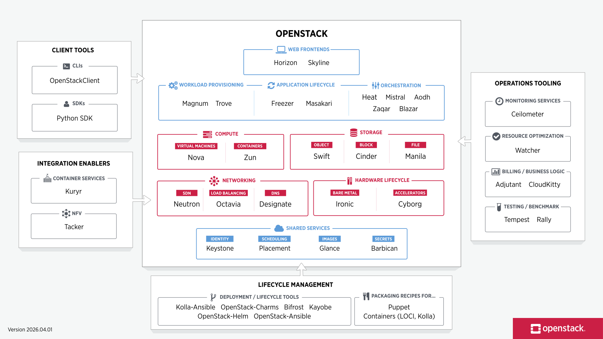

The Openstack Landscape

OpenStack’s modular framework allows you to identify and deploy components depending on your needs. The OpenStack map gives you a high level overview of the OpenStack landscape to see where those services fit and how they can work together.

[https://www.openstack.org/openstack-map](https://www.openstack.org/openstack-map)

Here is a simple bullet-list explanation of the blocks in the OpenStack diagram.[1]

- **Client tools:** These are the ways users and administrators interact with OpenStack, such as command-line tools and SDKs. They are used to request, manage, and automate cloud resources.[1]

- **OpenStackClient:** This is the main command-line tool for controlling OpenStack services from a terminal. It is useful for quick management and scripting.[1]

- **Python SDK:** This lets developers write Python programs that communicate with OpenStack services. It is useful for automation and custom cloud applications.[1]

- **Web frontends:** These are browser-based dashboards for managing the cloud. They give users a visual interface instead of using commands.[1]

- **Horizon:** This is the traditional OpenStack dashboard. It allows users to create and manage instances, networks, volumes, and other resources through a web page.[1]

- **Skyline:** This is a newer web dashboard with a modern interface. It helps users access and manage cloud resources more easily.[1]

- **Workload provisioning:** These services help deploy complete applications or groups of resources for users. They make it easier to create ready-to-use cloud environments.[1]

- **Magnum:** This service deploys container platforms such as Kubernetes on OpenStack. It helps users run container-based workloads.[1]

- **Trove:** This service provides database services as a cloud resource. It can be used to launch and manage databases more easily.[1]

- **Application lifecycle:** These services help manage cloud applications over time, including setup, maintenance, and automation. They support day-to-day operation of running systems.[1]

- **Freezer:** This is a backup and restore service. It helps protect cloud data and recover it when needed.[1]

- **Masakari:** This service provides instance high availability. If a host fails, it helps restart or recover affected virtual machines.[1]

- **Orchestration:** These services automate the creation and management of cloud resources. They are useful for repeatable deployments and complex infrastructure setups.[1]

- **Heat:** This is the main orchestration service. It uses templates to create and manage stacks of resources automatically.[1]

- **Mistral:** This is a workflow service that automates multi-step tasks. It helps coordinate actions in a defined sequence.[1]

- **Aodh:** This is an alarm service that reacts to monitoring conditions. It can trigger actions when a metric crosses a threshold.[1]

- **Zaqar:** This is a messaging service. It allows different applications or services to exchange messages asynchronously.[1]

- **Blazar:** This service supports resource reservation. It lets users reserve compute or other resources for future use.[1]

- **Compute:** These services provide processing power for running workloads. They are the core of virtualized cloud infrastructure.[1]

- **Nova:** This is the main virtual machine service. It creates and manages VM instances for users.[1]

- **Zun:** This service provides container management. It lets users run containers directly as cloud resources.[1]

- **Storage:** These services provide ways to store data in the cloud. They support different storage needs such as files, blocks, and objects.[1]

- **Swift:** This is object storage for large amounts of unstructured data. It is often used for backups, media, and archives.[1]

- **Cinder:** This is block storage for virtual machines. Users attach volumes to instances for persistent data storage.[1]

- **Manila:** This is shared file storage. It provides file systems that multiple users or instances can access.[1]

- **Networking:** These services connect cloud resources and control traffic between them. They manage virtual networks and related network functions.[1]

- **Neutron:** This is the main networking service. It creates virtual networks, subnets, routers, and security rules.[1]

- **Octavia:** This provides load balancing. It distributes traffic across multiple instances or services.[1]

- **Designate:** This is the DNS service. It manages domain name records for cloud resources.[1]

- **Hardware lifecycle:** These services manage physical infrastructure and special hardware. They support bare metal servers and accelerator devices.[1]

- **Ironic:** This provides bare metal provisioning. It lets OpenStack manage physical machines like cloud resources.[1]

- **Cyborg:** This manages accelerator hardware such as GPUs or FPGAs. It makes specialized hardware available to cloud users.[1]

- **Shared services:** These are common services used by many OpenStack components. They provide identity, scheduling, images, and secret management.[1]

- **Keystone:** This is the identity service. It handles login, authentication, roles, and permissions.[1]

- **Placement:** This tracks resource availability and helps decide where workloads should run. It supports scheduling and allocation.[1]

- **Glance:** This stores and manages VM images. Users use these images to launch new instances.[1]

- **Barbican:** This is the secret management service. It stores sensitive data such as keys and passwords securely.[1]

- **Operations tooling:** These services help administrators monitor, optimize, bill, and test the cloud. They support day-to-day cloud operations.[1]

- **Ceilometer:** This collects telemetry and usage data from the cloud. It is used for monitoring and metering.[1]

- **Watcher:** This helps optimize resource use automatically. It can suggest or carry out improvements based on policies.[1]

- **Adjutant:** This supports business and user-request workflows. It helps automate operational request handling.[1]

- **CloudKitty:** This is a rating and billing service. It helps calculate usage-based charges or reports.[1]

- **Tempest:** This is the OpenStack integration testing framework. It checks whether services work correctly together.[1]

- **Rally:** This is a benchmarking and validation tool. It measures performance and can test cloud deployment quality.[1]

- **Lifecycle management:** These tools help deploy, configure, and maintain OpenStack itself. They make installation and upgrades easier.[1]

- **Kolla-Ansible / OpenStack-Ansible / OpenStack-Helm / Bifrost / Kayobe / Charms:** These are deployment and automation tools used to install and manage OpenStack in different ways, such as with containers, Ansible, or Kubernetes.[1]

- **Puppet:** This is a configuration management tool. It automates system setup and service configuration.[1]

- **Containers (LOCI, Kolla):** These are packaging methods for OpenStack services. They help run services inside containers for easier deployment and updates.[1]

- **Kuryr:** This integrates container networking with OpenStack networking. It connects container platforms to Neutron.[1]

- **Tacker:** This manages network functions virtualization. It helps deploy and control virtual network services.[1]

- **OpenStack as a whole:** The diagram shows how all these services work together to provide users with compute, storage, networking, identity, orchestration, and operations support in one cloud platform.[1]